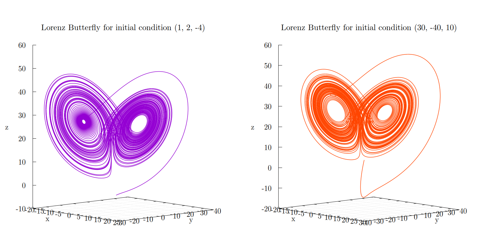
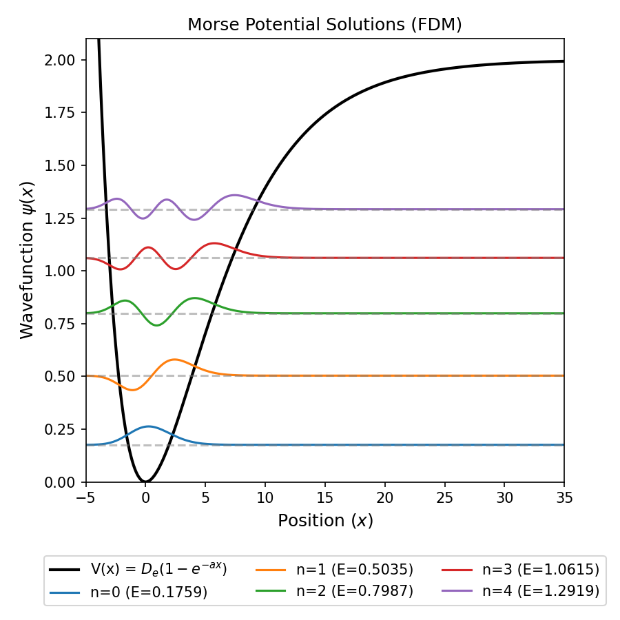

# Computational Physics Portfolio

> **Author:** Mohak Das  
> **Affiliation:** M.Sc. Physics (First Year), Jadavpur University (2025–26)  
> **Contact:** [mohakdas06@proton.me](mailto:mohakdas06@proton.me) | +91 8961576662

---

## 📖 About This Portfolio

This repository collects all assignments from a dedicated **Computational Physics** course. Each assignment is self-contained with:
- **Modular Fortran 90** source code (written from scratch, no external scientific libraries).
- **Compiled PDF reports** written in LaTeX with full derivations and analysis.
- **Plotting scripts** (Python or Gnuplot) for visualization.

The assignments span five domains:
| # | Assignment | Link |
| :--- | :--- | :--- |
|1.  |**Nonlinear Dynamics**  | [View Details](./01_NLD_Assignment/)|
|2.  |**Molecular Dynamics**  | [View Details](./02_MD_Simulation/)|
|3.  |**Monte Carlo Methods** | [View Details](./03_MC_Simulation/)|
|4.  |**Finite Difference Methods (FDM)** | [View Details](./04_FDM_Assinment/)|
|5.  |**WKB Approximation**   | [View Details](./05_WKB_Assignment/)|

### 🔭 Cosmological Relevance
While these are course assignments, the numerical methods implemented here are directly transferable to **cosmological research**:
- **N-Body Simulations:** The Velocity Verlet integrator and periodic boundary conditions used here form the basis for **Dark Matter halo formation** simulations.
- **Nonlinear Dynamics:** Techniques for analyzing phase portraits and strange attractors are essential for studying **scalar field dynamics in inflation**.
- **FDM & Eigenvalues:** Matrix diagonalization methods are critical for **cosmological perturbation theory** and stability analysis of spacetime metrics.

---

## 🚀 Quick Start

To run any simulation locally:

1.  **Clone the repository:**
    ```bash
    git clone https://github.com/mohakdas06/Computational-Physics-Portfolio.git
    cd Computational-Physics-Portfolio
    ```

2.  **Navigate to an assignment:**
    ```bash
    cd MD_Simulation        # Example: Molecular Dynamics
    ```

3.  **Compile and Run:**
    ```bash
    make clean
    make
    ./bin/main          # Or the specific executable name
    ```

4.  **Generate Plots:**
    ```bash
    make -f Makefile.plots          # Runs gnuplot/python scripts
    ```

*Note: Requires `gfortran` (≥ 9.0), `gnuplot` (≥ 5.4), and optionally `python3` (≥ 3.8).*

---

## 📂 Assignments at a Glance

| # | Assignment | Key Problems | Methods Used | Language |
| :--- | :--- | :--- | :--- | :--- |
| **1** | **Nonlinear Dynamics**<br>`NLD_Assignment/` | Simple pendulum, Lotka–Volterra, Lorenz attractor, quartic oscillator, saddle–centre system | RK5 integration, phase portraits, vector fields, strange attractors | F90 + Gnuplot |
| **2** | **Molecular Dynamics**<br>`MD_Simulation/` | Lennard-Jones N-body, energy conservation, velocity distribution, equilibration | Velocity Verlet integrator, periodic BCs, Microcanonical (NVE) ensemble | F90 + Gnuplot |
| **3** | **Monte Carlo**<br>`MC_Simulation/` | Numerical estimation of area under curves and volume under surfaces | Sampling method, Mean-value method | F90 + Gnuplot |
| **4** | **Finite Difference Method**<br>`FDM_Assignment/` | 1D Schrödinger equation for 14 quantum potentials (harmonic, Morse, double well, Dirac delta, etc.) | FDM matrix diagonalisation, eigenvalue problems | F90 + Python |
| **5** | **WKB Approximation**<br>`WKB_Assignment/` | Numerical estimation of eigenenergies of slowly varying 1D potentials | Trapezoidal rule, Bisection Method | F90 |

---

## 🛠 Technical Highlights

### Modular Fortran 90 Architecture
Shared solver modules are written as reusable Fortran modules and linked against multiple problem programs. **No solver code is duplicated.**
- `RK5_solver.f90`: High-order Runge-Kutta integrator.
- `FDM_toolbox.f90`: Matrix construction and diagonalization utilities.
- `constants_mod.f90`: Physical constants and precision definition.

### Build system
Each assignment has a `Makefile` managing compilation dependencies.
Assignments with separate plotting pipelines use a second `Makefile.plots`.

### Reproducible Pipeline
The chain from source to figure is fully reproducible:
`source (.f90)` → `executable` → `output data` → `plotting script` → `figure (.pdf)` → `LaTeX report`.
*No manual steps are required between stages.*

### Documentation
Every assignment includes:
- A `README.md` describing the physical problem and build instructions.
- A LaTeX report with full derivations, result tables, and discussion.

---

## 📁 Repository Structure

```text
Computational_Physics_Portfolio/
├── README.md              # This file
├── NLD_Assignment/        # Nonlinear Dynamics
│   ├── src/               # Fortran source
│   ├── plots/             # Generated figures
│   ├── Makefile
│   └── report.pdf
├── MD_Simulation/         # Molecular Dynamics
├── MC_Simulation/         # Monte Carlo
├── FDM_Assignment/        # Finite Difference Methods
└── WKB_Assignment/        # WKB Approximation
```
Each subdirectory follows the same internal structure: src/, plots/, Makefile, and report.pdf (name may differ).

---

## 🧰 Dependencies
|Tool               | Version    | Used In                 |
|-------------------|------------|-------------------------|
|gfortran           | ≥ 9.0      | All assignments         |
|Python             | ≥ 3.8      | FDM (matplotlib, numpy) |
|Gnuplot            | ≥ 5.4      | NLD, MD, MC             |
|LaTeX (pdflatex)   | Any recent | All reports             |

---
## Sample Output
### Lorenz Attractor


### Morse Potential


---

## 📄 License & Credits
All work is original. Programs were written and tested on Linux (Ubuntu 24.04).
This portfolio was created for academic purposes as part of the M.Sc. Physics curriculum at Jadavpur University.
Repository last updated: April 2026
